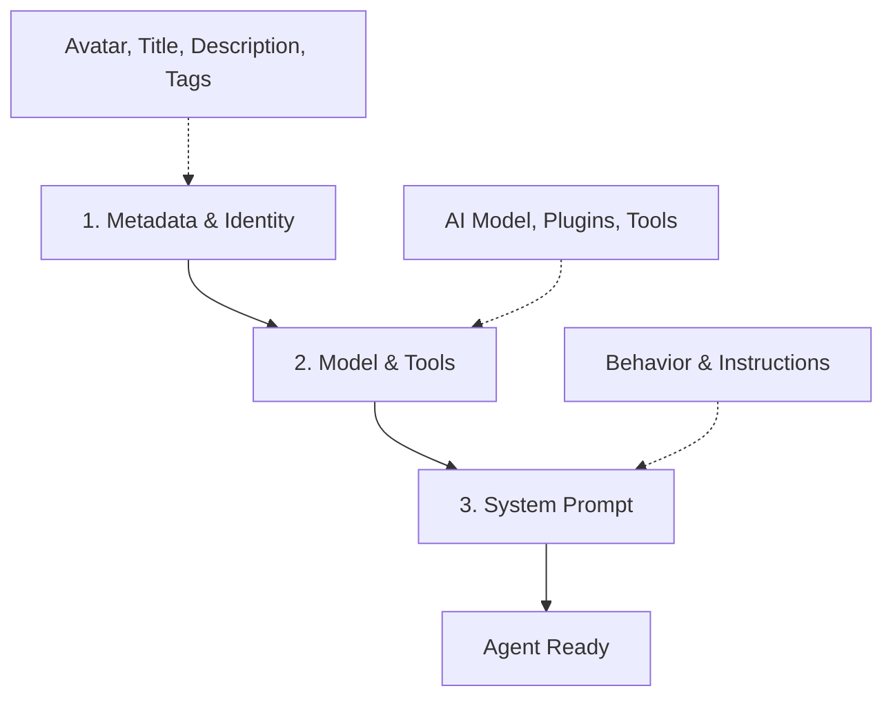

# Agent Builder

The Agent Builder is an AI-powered tool that helps you create and configure agents through natural conversation. Instead of manually setting each configuration option, simply describe what you need and let the Agent Builder handle the details.

## Overview

Agent Builder is a built-in tool (`lobe-agent-builder`) that acts as your configuration assistant. It understands:

- Current agent configuration and metadata
- Available AI models and their capabilities
- Available tools and plugins in the marketplace
- Best practices for agent configuration

## How It Works

<Steps>

### Access Agent Builder

The Agent Builder is available in the right panel when configuring any agent. It automatically has access to:

- Your agent's current configuration
- Available AI models and providers
- Official tools and marketplace plugins
- Configuration best practices

### Describe Your Needs

Simply tell the Agent Builder what you want in natural language:

<CodeGroup>
```text English Examples
"Create a coding assistant that helps with Python and JavaScript"

"Change the model to Claude and make it more creative"

"Add web browsing and enable the knowledge base"

"I need an agent for customer support with a friendly tone"
```

```text Chinese Examples
"帮我创建一个代码助手"

"把模型改成 Claude，并且设置 temperature 为 0.7"

"添加网页浏览功能和知识库"

"我想要一个客服助手，语气要友好一些"
```
</CodeGroup>

### Review and Apply Changes

The Agent Builder will:

1. Understand your requirements
2. Make appropriate configuration changes
3. Explain what was changed and why
4. Apply changes in the optimal order

</Steps>

## Configuration Sequence

Agent Builder follows a specific sequence for optimal results:



**Why this order?**
- **Step 1**: Establishes who the agent is
- **Step 2**: Defines what capabilities it has
- **Step 3**: Writes instructions that reference identity and tools

This ensures the system prompt can reference the agent's established identity and available capabilities.

## Available Operations

The Agent Builder can perform these operations:

### Read Operations

<CardGroup cols={2}>
  <Card title="Get Available Models" icon="microchip">
    Retrieves all AI models and providers with their capabilities (vision, function calling, reasoning)
  </Card>
  <Card title="Search Marketplace" icon="magnifying-glass">
    Finds tools and plugins in the MCP marketplace
  </Card>
</CardGroup>

### Write Operations

<CardGroup cols={2}>
  <Card title="Update Configuration" icon="sliders">
    Modifies model, provider, plugins, parameters, and chat settings
  </Card>
  <Card title="Update Metadata" icon="tag">
    Changes title, description, avatar, tags, and background color
  </Card>
  <Card title="Update Prompt" icon="file-text">
    Writes or refines the system prompt with optional streaming
  </Card>
  <Card title="Toggle Plugins" icon="toggle-on">
    Enables or disables specific plugins
  </Card>
  <Card title="Install Plugin" icon="download">
    Installs and enables plugins from marketplace or official sources
  </Card>
</CardGroup>

## Usage Examples

### Create a Specialized Agent

<CodeGroup>
```typescript Request
"Create a data analyst agent that can work with CSV files 
and create visualizations"
```

```typescript Agent Builder Actions
// Step 1: Set Identity
updateMeta({
  avatar: "📊",
  title: "Data Analyst",
  description: "Expert at analyzing data and creating insights",
  tags: ["data", "analytics", "visualization"]
})

// Step 2: Configure Model & Tools
updateConfig({
  config: {
    model: "gpt-4o",
    provider: "openai",
    plugins: ["lobe-skills", "lobe-artifacts"]
  }
})

// Step 3: Write System Prompt
updatePrompt({
  prompt: "You are a Data Analyst specialized in...",
  streaming: true
})
```
</CodeGroup>

### Switch AI Models

<CodeGroup>
```text Request
"Switch to Claude Sonnet and make it more creative for brainstorming"
```

```typescript Agent Builder Actions
updateConfig({
  config: {
    model: "claude-sonnet-4-5-20250929",
    provider: "anthropic",
    params: {
      temperature: 1.2  // Higher creativity
    }
  }
})
```
</CodeGroup>

### Add Multiple Capabilities

<CodeGroup>
```text Request
"Enable web browsing, knowledge base, and add an opening message"
```

```typescript Agent Builder Actions
// Batches all changes in one call for better UX
updateConfig({
  config: {
    plugins: ["lobe-web-browsing", "lobe-knowledge-base"],
    openingMessage: "Hello! I can browse the web and access our knowledge base to help you."
  }
})
```
</CodeGroup>

### Install Marketplace Tools

<CodeGroup>
```text Request
"Find me tools for web searching"
```

```typescript Agent Builder Actions
// 1. Search marketplace
searchMarketTools({
  query: "web search",
  category: "web-search",
  pageSize: 10
})

// 2. Shows results with install buttons
// User can install directly from results

// 3. Or install programmatically
installPlugin({
  identifier: "mcp-tavily-search",
  source: "market"
})
```
</CodeGroup>

### Refine System Prompt

<CodeGroup>
```text Request
"Make the agent's tone more professional and concise"
```

```typescript Agent Builder Actions
// Agent Builder reads current prompt and refines it
updatePrompt({
  prompt: `You are a professional assistant...
  
## Communication Style
- Be concise and direct
- Use professional language
- Focus on actionable information
- Avoid unnecessary explanations`,
  streaming: true
})
```
</CodeGroup>

## Configuration Best Practices

The Agent Builder follows these principles:

<AccordionGroup>
  <Accordion title="Batch Configuration Updates">
    When multiple config fields need changes, Agent Builder merges them into a single `updateConfig` call to prevent race conditions and improve UX.
    
    **Good**: `updateConfig({ config: { model: "...", temperature: 0.7, openingMessage: "..." } })`
    
    **Bad**: Multiple sequential `updateConfig` calls
  </Accordion>
  
  <Accordion title="Sequential Plugin Installation">
    When installing multiple plugins, Agent Builder installs them one by one. This ensures:
    - Better error handling per plugin
    - Users understand each plugin's purpose
    - Easier troubleshooting if something fails
  </Accordion>
  
  <Accordion title="User-Friendly Names">
    Agent Builder uses semantic names instead of technical field names:
    - "System Prompt" instead of "systemRole"
    - "Creativity Level" instead of "temperature"
    - "Opening Message" instead of "openingMessage"
  </Accordion>
  
  <Accordion title="Language Adaptation">
    Agent Builder responds in the same language you use, adapting technical terms appropriately.
  </Accordion>
</AccordionGroup>

## Advanced Configuration

### Model Parameters

```typescript
// Fine-tune model behavior
updateConfig({
  config: {
    params: {
      temperature: 0.7,         // Creativity (0-2)
      top_p: 1,                 // Sampling range (0-1)
      frequency_penalty: 0.5,   // Reduce repetition (0-2)
      presence_penalty: 0.3     // Topic diversity (0-2)
    }
  }
})
```

**Parameter Guide**:
- **temperature**: Higher = more creative/random, Lower = more focused/deterministic
- **top_p**: Alternative to temperature for controlling randomness
- **frequency_penalty**: Penalizes repeated tokens
- **presence_penalty**: Encourages new topics

### Chat Settings

```typescript
// Configure conversation behavior
updateConfig({
  config: {
    chatConfig: {
      historyCount: 30,              // More context
      enableReasoning: true,         // Enable CoT for supported models
      enableAutoCreateTopic: true,   // Auto-organize conversations
      autoCreateTopicThreshold: 3    // Messages before topic creation
    }
  }
})
```

### Opening Experience

```typescript
// Set welcome message and questions
updateConfig({
  config: {
    openingMessage: "Welcome! I'm your coding assistant.",
    openingQuestions: [
      "What programming language are you working with?",
      "Do you need help debugging or writing new code?",
      "Would you like me to explain any concepts?"
    ]
  }
})
```

## API Reference

The Agent Builder provides these APIs:

```typescript
// Get available models
getAvailableModels({
  providerId?: string  // Optional: filter by provider
})

// Search marketplace tools
searchMarketTools({
  query?: string,      // Search keywords
  category?: string,   // Filter by category
  pageSize?: number    // Results to return (max 20)
})

// Update agent configuration
updateAgentConfig({
  meta?: { /* metadata fields */ },
  config?: { /* config fields */ },
  togglePlugin?: {
    pluginId: string,
    enabled?: boolean
  }
})

// Update system prompt
updatePrompt({
  prompt: string,
  streaming?: boolean  // Typewriter effect (default: true)
})

// Install plugin
installPlugin({
  identifier: string,  // Plugin identifier
  source: "market" | "official"
})
```

See the [full manifest](/home/daytona/workspace/source/packages/builtin-tool-agent-builder/src/manifest.ts:1) for detailed API specifications.

## Tips & Tricks

<CardGroup cols={2}>
  <Card title="Ask for Recommendations" icon="lightbulb">
    "What model should I use for code analysis?" - Agent Builder will explain trade-offs
  </Card>
  <Card title="Batch Requests" icon="layer-group">
    "Set up a customer service agent with web browsing and friendly tone" - Multiple changes at once
  </Card>
  <Card title="Iterate Quickly" icon="rotate">
    "Make it more creative" or "Reduce the temperature" - Quick refinements
  </Card>
  <Card title="Explore Marketplace" icon="store">
    "Show me development tools" - Browse available plugins by category
  </Card>
</CardGroup>

## Next Steps

<CardGroup cols={2}>
  <Card title="Add Skills" icon="puzzle-piece" href="/agents/skills">
    Extend agent capabilities with reusable skills
  </Card>
  <Card title="Tool Integration" icon="wrench" href="/agents/tools">
    Connect external tools and services
  </Card>
  <Card title="Knowledge Base" icon="book" href="/agents/knowledge-base">
    Add domain-specific knowledge
  </Card>
  <Card title="Agent Marketplace" icon="store" href="/agents/marketplace">
    Share your agents with the community
  </Card>
</CardGroup>
