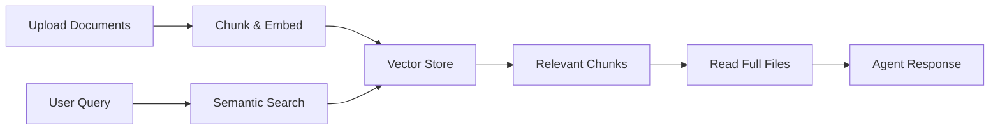

# Knowledge Base Management

The Knowledge Base tool enables agents to access and search through uploaded documents using semantic vector search. It's perfect for creating agents with domain-specific expertise.

## Overview

Knowledge Base provides:

- **Semantic Search**: Vector-based search that understands meaning, not just keywords
- **Document Retrieval**: Read full file contents from search results
- **Multiple Formats**: Support for documents, PDFs, text files, and more
- **Persistent Storage**: Knowledge persists across conversations
- **Chunked Processing**: Large documents split into searchable chunks

## How It Works



<Steps>

### Upload Documents

Upload files to your agent's knowledge base through the UI.

### Embedding Process

Documents are:
1. Split into manageable chunks
2. Converted to vector embeddings
3. Stored in the vector database
4. Associated with metadata (filename, chunk position)

### Semantic Search

When queried, the system:
1. Converts query to vector embedding
2. Finds most similar chunks via cosine similarity
3. Returns files and excerpts ranked by relevance

### Document Retrieval

Agent can read full file contents based on search results.

</Steps>

## Using Knowledge Base

### Enable the Tool

First, enable Knowledge Base for your agent:

```typescript
// Via Agent Builder
"Enable the knowledge base tool"

// Or programmatically
updateAgentConfig({
  config: {
    plugins: ["lobe-knowledge-base"]
  }
})
```

### Search Knowledge

Agents use semantic search to find relevant information:

```typescript
// Search with natural language query
searchKnowledgeBase({
  query: "authentication system security best practices",
  topK: 15  // Number of chunks to return (default: 15)
})

// Returns
{
  results: [
    {
      fileId: "file_abc123",
      filename: "security-guidelines.pdf",
      relevanceScore: 0.92,
      excerpt: "Authentication should use JWT tokens with...",
      chunks: [
        {
          chunkId: "chunk_1",
          content: "Full chunk content...",
          score: 0.92
        }
      ]
    }
  ]
}
```

### Read Full Files

Retrieve complete file contents:

```typescript
// Read one or more files by ID
readKnowledge({
  fileIds: ["file_abc123", "file_def456"]
})

// Returns
{
  files: [
    {
      fileId: "file_abc123",
      filename: "security-guidelines.pdf",
      content: "Complete file content...",
      metadata: {
        size: 45678,
        uploadedAt: "2025-03-01T10:00:00Z"
      }
    }
  ]
}
```

## Search Best Practices

### Resolve References

**Important**: Knowledge Base uses vector-based semantic search. Always resolve pronouns and references to concrete entities.

<CodeGroup>
```text ❌ Bad Queries
"What does it do?"
"Tell me about that"
"How does this work?"
"More info on them"
```

```text ✅ Good Queries  
"What does the authentication system do?"
"Tell me about JWT token implementation"
"How does the payment processing workflow work?"
"More info on the API rate limiting features"
```
</CodeGroup>

**Why?** Vector search works by semantic similarity. Pronouns like "it" or "that" have no semantic meaning on their own and will produce poor results.

### Query Formulation

<AccordionGroup>
  <Accordion title="Be Specific">
    Use precise terminology and context:
    
    - "user authentication with OAuth 2.0" ✅
    - "login stuff" ❌
  </Accordion>
  
  <Accordion title="Include Context">
    Add relevant details to narrow scope:
    
    - "React component testing with Jest" ✅
    - "testing" ❌
  </Accordion>
  
  <Accordion title="Use Full Names">
    Expand abbreviations on first search:
    
    - "JSON Web Token authentication" ✅
    - "JWT auth" (use after establishing context) ✅
  </Accordion>
  
  <Accordion title="Natural Language">
    Write queries as complete questions or phrases:
    
    - "How to implement password reset functionality" ✅
    - "password reset how" ❌
  </Accordion>
</AccordionGroup>

### Adjust topK Parameter

```typescript
// For focused, specific queries
searchKnowledgeBase({ 
  query: "exact error code E4032",
  topK: 5  // Fewer, more relevant results
})

// For broad research topics
searchKnowledgeBase({
  query: "overview of microservices architecture",
  topK: 30  // More comprehensive coverage
})

// Default balanced approach
searchKnowledgeBase({
  query: "user authentication methods",
  topK: 15  // Default
})
```

## Workflow Strategies

### Two-Step Search Pattern

The recommended approach:

<Steps>

### Search First

Use `searchKnowledgeBase` to discover relevant files:

```typescript
const results = await searchKnowledgeBase({
  query: "database migration procedures",
  topK: 15
});

// Review results:
// - "database-guide.md" (score: 0.89)
// - "migration-steps.pdf" (score: 0.85)
// - "troubleshooting.md" (score: 0.72)
```

### Read Selected Files

Retrieve full content from most relevant files:

```typescript
const files = await readKnowledge({
  fileIds: [
    results[0].fileId,  // database-guide.md
    results[1].fileId   // migration-steps.pdf
  ]
});

// Now have complete context to answer user's question
```

</Steps>

### Iterative Refinement

For complex queries, search multiple times:

```typescript
// 1. Broad initial search
const overview = await searchKnowledgeBase({
  query: "payment processing system",
  topK: 10
});

// 2. Refine based on results
const specific = await searchKnowledgeBase({
  query: "payment processing error handling and retries",
  topK: 15
});

// 3. Read most relevant files
const files = await readKnowledge({
  fileIds: [...overview, ...specific]
    .sort((a, b) => b.score - a.score)
    .slice(0, 3)
    .map(r => r.fileId)
});
```

### Batch Reading

Read multiple related files at once:

```typescript
// Search returns multiple relevant files
const results = await searchKnowledgeBase({
  query: "API integration guide",
  topK: 20
});

// Read top 5 files in one call
const files = await readKnowledge({
  fileIds: results.slice(0, 5).map(r => r.fileId)
});
```

## Use Cases

<CardGroup cols={2}>
  <Card title="Technical Documentation" icon="book-open">
    Upload API docs, guides, and references. Agents can answer technical questions accurately.
  </Card>
  
  <Card title="Company Knowledge" icon="building">
    Store policies, procedures, and internal docs. Create agents that know your organization.
  </Card>
  
  <Card title="Customer Support" icon="headset">
    Upload product manuals and FAQs. Agents provide accurate support responses.
  </Card>
  
  <Card title="Research Assistant" icon="flask">
    Upload papers and articles. Agents synthesize information across documents.
  </Card>
  
  <Card title="Code Documentation" icon="code">
    Store architecture docs and code guides. Agents help developers understand codebases.
  </Card>
  
  <Card title="Legal/Compliance" icon="scale-balanced">
    Upload regulations and policies. Agents provide compliant guidance.
  </Card>
</CardGroup>

## Advanced Features

### Relevance Scoring

Results include relevance scores (0-1):

```typescript
// Interpret scores
if (result.relevanceScore > 0.85) {
  // Highly relevant - strong match
} else if (result.relevanceScore > 0.7) {
  // Moderately relevant - worth reviewing
} else {
  // Low relevance - may not be useful
}
```

### Excerpt Preview

Search results include brief excerpts:

```typescript
results.forEach(result => {
  console.log(`${result.filename} (${result.relevanceScore})`);
  console.log(`Preview: ${result.excerpt}`);
  // Helps decide if full file read is needed
});
```

### Chunk-Level Results

Access individual chunks for fine-grained info:

```typescript
results.forEach(result => {
  result.chunks.forEach(chunk => {
    console.log(`Chunk ${chunk.chunkId}: ${chunk.content}`);
    console.log(`Score: ${chunk.score}`);
  });
});
```

## Citation & Attribution

Always cite sources when using knowledge base:

```markdown
## Response Template

Based on the security guidelines (security-guidelines.pdf), 
authentication should use JWT tokens with:

1. Short expiration times (15 minutes for access tokens)
2. Secure refresh token rotation
3. HTTPS-only transmission

Source: security-guidelines.pdf, Section 3.2
```

**Best Practices**:
- Reference specific files by name
- Include section/page numbers when available
- Quote directly for critical information
- Indicate when synthesizing across multiple sources

## System Prompt Integration

Guide knowledge base usage in system prompts:

```markdown
# Customer Support Agent

You are a customer support agent with access to our product documentation.

## Knowledge Base Usage

1. **Always search first**: Before answering product questions, 
   search the knowledge base
2. **Cite sources**: Reference specific documents in your responses
3. **Verify information**: If unsure, read the full document
4. **Update knowledge**: If you can't find info, inform the user 
   and suggest they check if docs are up to date

## Search Strategy

- Product features → "[product name] [feature] documentation"
- Troubleshooting → "[issue description] troubleshooting"
- Setup guides → "[product] installation setup guide"

## Citation Format

Always format responses like:
"According to [document name], [information]. (Source: [filename])"
```

## File Management

### Supported Formats

- **Documents**: PDF, DOCX, TXT, MD
- **Code**: Most programming languages
- **Data**: CSV, JSON, XML
- **Web**: HTML

### File Organization

**Best Practices**:
- Use clear, descriptive filenames
- Organize by topic or category
- Keep files updated and remove outdated ones
- Use version numbers for evolving docs
- Break large documents into focused files

### File Size Limits

- Individual files: Up to 10MB recommended
- Large files are automatically chunked
- Very large files may need preprocessing

## Troubleshooting

<AccordionGroup>
  <Accordion title="No Search Results">
    **Problem**: Search returns no relevant results
    
    **Solutions**:
    - Verify documents are uploaded and processed
    - Rephrase query with different terminology
    - Use broader, more general search terms
    - Check if topic is covered in uploaded docs
    - Resolve pronouns to concrete entity names
  </Accordion>
  
  <Accordion title="Poor Relevance Scores">
    **Problem**: All results have low scores (less than 0.6)
    
    **Solutions**:
    - Reformulate query with more context
    - Try multiple related queries
    - Verify document quality and format
    - Check if chunking is appropriate
    - Use full entity names instead of pronouns
  </Accordion>
  
  <Accordion title="Can't Read File">
    **Problem**: `readKnowledge` fails to retrieve file
    
    **Solutions**:
    - Verify file ID is correct (from search results)
    - Check file wasn't deleted
    - Try searching again to get fresh file ID
    - Ensure agent has access permissions
  </Accordion>
  
  <Accordion title="Irrelevant Results">
    **Problem**: Results don't match query intent
    
    **Solutions**:
    - Add more specific context to query
    - Use exact terminology from documents
    - Try different query formulations
    - Reduce topK to focus on best matches
    - Ensure query uses concrete nouns, not pronouns
  </Accordion>
</AccordionGroup>

## Performance Tips

<AccordionGroup>
  <Accordion title="Optimize topK">
    - Start with default (15)
    - Reduce for very specific queries (5-10)
    - Increase for broad research (20-30)
    - Higher topK = more processing time
  </Accordion>
  
  <Accordion title="Batch File Reads">
    Read multiple files in one call instead of sequential reads:
    
    ```typescript
    // Good
    readKnowledge({ fileIds: ["id1", "id2", "id3"] })
    
    // Avoid
    await readKnowledge({ fileIds: ["id1"] })
    await readKnowledge({ fileIds: ["id2"] })
    await readKnowledge({ fileIds: ["id3"] })
    ```
  </Accordion>
  
  <Accordion title="Use Excerpts First">
    Review search result excerpts before reading full files. 
    Often the excerpt contains enough information.
  </Accordion>
  
  <Accordion title="Cache Results">
    If answering similar questions, reuse search results 
    instead of searching repeatedly.
  </Accordion>
</AccordionGroup>

## Next Steps

<CardGroup cols={2}>
  <Card title="Tool Integration" icon="wrench" href="/agents/tools">
    Explore other tools to combine with Knowledge Base
  </Card>
  <Card title="Skills" icon="puzzle-piece" href="/agents/skills">
    Use skills to create knowledge workflows
  </Card>
  <Card title="Agent Builder" icon="wand-magic-sparkles" href="/agents/agent-builder">
    Configure knowledge-based agents with AI
  </Card>
  <Card title="Creating Agents" icon="user-plus" href="/agents/creating-agents">
    Build specialized knowledge agents
  </Card>
</CardGroup>
