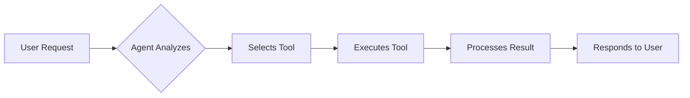

# Tool Integration

Tools extend your agent's capabilities by connecting to external services, APIs, and systems. LobeHub supports a rich ecosystem of built-in tools, MCP plugins, and OAuth integrations.

## Tool Categories

LobeHub organizes tools into three categories:

<CardGroup cols={3}>
  <Card title="Built-in Tools" icon="toolbox">
    Core LobeHub capabilities like Knowledge Base, Skills, and Memory
  </Card>
  <Card title="MCP Plugins" icon="plug">
    Marketplace plugins following Model Context Protocol
  </Card>
  <Card title="OAuth Services" icon="key">
    LobehubSkill providers requiring authentication
  </Card>
</CardGroup>

## Built-in Tools

These tools are available out-of-the-box in LobeHub:

### Core Agent Tools

<CardGroup cols={2}>
  <Card title="Agent Builder" icon="wand-magic-sparkles">
    **Identifier**: `lobe-agent-builder`
    
    AI-powered agent configuration assistant. Helps you create and optimize agents through natural conversation.
    
    [Learn more →](/agents/agent-builder)
  </Card>
  
  <Card title="Agent Management" icon="users">
    **Identifier**: `lobe-agent-management`
    
    Manage your agent library: create, delete, search, and organize agents programmatically.
  </Card>
  
  <Card title="Group Management" icon="users-between-lines">
    **Identifier**: `lobe-group-management`
    
    Create and manage agent groups for multi-agent collaboration.
  </Card>
  
  <Card title="Group Agent Builder" icon="users-gear">
    **Identifier**: `lobe-group-agent-builder`
    
    AI assistant for configuring agent groups and team workflows.
  </Card>
</CardGroup>

### Knowledge & Memory

<CardGroup cols={2}>
  <Card title="Knowledge Base" icon="book-open">
    **Identifier**: `lobe-knowledge-base`
    
    Semantic search through uploaded documents. Query domain knowledge and retrieve relevant information.
    
    [Learn more →](/agents/knowledge-base)
  </Card>
  
  <Card title="Memory" icon="brain">
    **Identifier**: `lobe-memory`
    
    Personal memory system that learns from conversations and remembers user preferences.
  </Card>
  
  <Card title="Skills" icon="puzzle-piece">
    **Identifier**: `lobe-skills`
    
    Activate reusable instruction packages and execute skill workflows.
    
    [Learn more →](/agents/skills)
  </Card>
  
  <Card title="Skill Store" icon="store">
    **Identifier**: `lobe-skill-store`
    
    Browse and install skills from the community skill marketplace.
  </Card>
</CardGroup>

### Productivity Tools

<CardGroup cols={2}>
  <Card title="Web Browsing" icon="globe">
    **Identifier**: `lobe-web-browsing`
    
    Search the internet and browse web pages in real-time.
  </Card>
  
  <Card title="Notebook" icon="notebook">
    **Identifier**: `lobe-notebook`
    
    Create, edit, and manage notes during conversations.
  </Card>
  
  <Card title="GTD (Getting Things Done)" icon="list-checks">
    **Identifier**: `lobe-gtd`
    
    Task management and productivity system following GTD methodology.
  </Card>
  
  <Card title="Page Agent" icon="file-text">
    **Identifier**: `lobe-page-agent`
    
    Work with agents in dedicated page environments for focused collaboration.
  </Card>
</CardGroup>

### Development Tools

<CardGroup cols={2}>
  <Card title="Cloud Sandbox" icon="server">
    **Identifier**: `lobe-cloud-sandbox`
    
    Execute code and commands in isolated cloud environments.
  </Card>
  
  <Card title="Local System" icon="terminal">
    **Identifier**: `lobe-local-system`
    
    Access local file system and execute commands (Desktop app only).
  </Card>
  
  <Card title="Calculator" icon="calculator">
    **Identifier**: `lobe-calculator`
    
    Perform mathematical calculations and solve equations.
  </Card>
  
  <Card title="Tools Manager" icon="wrench">
    **Identifier**: `lobe-tools`
    
    Manage and configure available tools and plugins.
  </Card>
</CardGroup>

## MCP Marketplace Plugins

The Model Context Protocol (MCP) marketplace offers thousands of community-built plugins:

### Popular MCP Plugins

<CardGroup cols={2}>
  <Card title="Tavily Search" icon="magnifying-glass">
    **Identifier**: `mcp-tavily-search`
    
    Advanced web search optimized for AI agents. Get accurate, real-time information.
    
    **Category**: Web Search
  </Card>
  
  <Card title="Brave Search" icon="shield-halved">
    **Identifier**: `mcp-brave-search`
    
    Privacy-focused web search with Brave Search API.
    
    **Category**: Web Search
  </Card>
  
  <Card title="GitHub" icon="github">
    **Identifier**: `mcp-github`
    
    Interact with GitHub repositories, issues, PRs, and code.
    
    **Category**: Developer
  </Card>
  
  <Card title="Filesystem" icon="folder-tree">
    **Identifier**: `mcp-filesystem`
    
    Read and write files in specified directories.
    
    **Category**: Developer
  </Card>
  
  <Card title="PostgreSQL" icon="database">
    **Identifier**: `mcp-postgres`
    
    Connect to PostgreSQL databases and run queries.
    
    **Category**: Developer
  </Card>
  
  <Card title="Puppeteer" icon="browser">
    **Identifier**: `mcp-puppeteer`
    
    Browser automation for web scraping and testing.
    
    **Category**: Developer
  </Card>
</CardGroup>

### Searching the Marketplace

Use the Agent Builder to find plugins:

```typescript
// Search by keyword
searchMarketTools({
  query: "web search",
  pageSize: 10
})

// Browse by category
searchMarketTools({
  category: "developer",
  pageSize: 20
})

// Get all available tools
searchMarketTools({
  pageSize: 20
})
```

**Available Categories**:
- `developer` - Development tools and APIs
- `productivity` - Task management and organization
- `web-search` - Internet search services
- `tools` - General utilities
- `media-generate` - Image, video, audio generation

## OAuth Services (LobehubSkill)

These services require OAuth authentication:

<CardGroup cols={2}>
  <Card title="Linear" icon="check-square">
    Connect to Linear for issue tracking and project management.
  </Card>
  
  <Card title="Outlook Calendar" icon="calendar">
    Access and manage your Outlook calendar events.
  </Card>
  
  <Card title="Twitter (X)" icon="twitter">
    Post tweets and interact with Twitter API.
  </Card>
  
  <Card title="Google Calendar" icon="calendar-days">
    Manage Google Calendar events and schedules.
  </Card>
</CardGroup>

## Installing Tools

<Steps>

### Find the Tool

Search for tools in the marketplace:

```typescript
// Via Agent Builder
"Find me a tool for web searching"

// Or programmatically
searchMarketTools({ query: "web search" })
```

### Install the Plugin

Install from marketplace or official sources:

```typescript
// Install MCP marketplace plugin
installPlugin({
  identifier: "mcp-tavily-search",
  source: "market"
})

// Install official tool/OAuth service
installPlugin({
  identifier: "linear",
  source: "official"
})
```

**Note**: OAuth services will open a connection flow for user authentication.

### Enable for Agent

Add the tool to your agent's plugin list:

```typescript
updateAgentConfig({
  config: {
    plugins: [
      "lobe-web-browsing",
      "mcp-tavily-search",
      "lobe-knowledge-base"
    ]
  }
})
```

</Steps>

## Using Tools

Once enabled, agents can use tools automatically:

### Automatic Tool Selection

Agents intelligently select the right tool:

```typescript
// User asks: "What's the latest news about AI?"
// Agent automatically uses web browsing tool

// User asks: "Search our documentation for authentication"
// Agent uses knowledge base tool

// User asks: "Run this Python script"
// Agent uses cloud sandbox or local system tool
```

### Tool Call Flow



### Manual Tool Control

You can also guide tool usage in the system prompt:

```markdown
# Customer Support Agent

## Tool Usage Guidelines

1. **Knowledge Base**: Always search knowledge base first for product info
2. **Web Browsing**: Use for current product status or outages
3. **Memory**: Remember customer preferences and history

## When to Use Tools
- Product questions → Knowledge Base
- Status checks → Web Browsing  
- Returning customers → Memory for context
```

## Tool Configuration

Some tools accept configuration parameters:

### Knowledge Base Configuration

```typescript
// Search with custom parameters
searchKnowledgeBase({
  query: "authentication system",
  topK: 20  // Return more results
})
```

### Cloud Sandbox Configuration

```typescript
// Execute with timeout
runCommand({
  command: "python script.py",
  timeout: 30000,  // 30 seconds
  workdir: "/workspace"
})
```

### Skills Configuration

```typescript
// Execute script in specific environment
execScript({
  command: "npm install",
  config: { id: skillId, name: skillName },
  runInClient: true  // Desktop app: run locally
})
```

## Tool Development

Create custom tools for your specific needs:

### MCP Plugin Structure

```typescript
interface MCPPlugin {
  identifier: string;
  meta: {
    title: string;
    description: string;
    avatar?: string;
  };
  api: {
    name: string;
    description: string;
    parameters: JSONSchema;
  }[];
  systemRole?: string;
}
```

### Built-in Tool Structure

```typescript
interface BuiltinTool {
  identifier: string;
  meta: {
    title: string;
    description: string;
    avatar: string;
  };
  api: ToolAPI[];
  systemRole: string;
  type: 'builtin';
}
```

See the [Plugin Development Guide](https://lobehub.com/docs/usage/plugins/development) for detailed instructions.

## Tool Best Practices

<AccordionGroup>
  <Accordion title="Enable Only Needed Tools">
    Too many tools can confuse the agent. Only enable tools your agent actually needs for its tasks.
  </Accordion>
  
  <Accordion title="Test Tool Combinations">
    Test how tools work together. Some combinations are more powerful than others.
  </Accordion>
  
  <Accordion title="Document Tool Usage">
    In your system prompt, document when and how to use each tool for consistent behavior.
  </Accordion>
  
  <Accordion title="Handle Tool Failures">
    Prepare agents to handle tool failures gracefully. Include fallback strategies in prompts.
  </Accordion>
  
  <Accordion title="Monitor Tool Usage">
    Track which tools are used most. Remove unused tools to keep agents focused.
  </Accordion>
  
  <Accordion title="Consider Tool Costs">
    Some tools (API calls, searches) have usage costs. Factor this into agent design.
  </Accordion>
</AccordionGroup>

## Troubleshooting

<AccordionGroup>
  <Accordion title="Tool Not Available">
    **Problem**: Agent can't access enabled tool
    
    **Solutions**:
    - Verify tool is in agent's plugins list
    - Check tool installation completed successfully
    - For OAuth tools, ensure authentication succeeded
    - Restart agent or refresh configuration
  </Accordion>
  
  <Accordion title="Tool Call Fails">
    **Problem**: Tool execution returns error
    
    **Solutions**:
    - Check tool parameters match schema
    - Verify required permissions (API keys, OAuth)
    - Review tool documentation for usage
    - Check network connectivity for external tools
  </Accordion>
  
  <Accordion title="Agent Ignores Tool">
    **Problem**: Agent doesn't use available tool
    
    **Solutions**:
    - Make tool purpose clear in system prompt
    - Provide examples of when to use tool
    - Ensure request matches tool capabilities
    - Check if another tool is more suitable
  </Accordion>
  
  <Accordion title="OAuth Connection Failed">
    **Problem**: Can't connect OAuth service
    
    **Solutions**:
    - Check authorization popup wasn't blocked
    - Verify service credentials are correct
    - Try disconnecting and reconnecting
    - Check service status and availability
  </Accordion>
</AccordionGroup>

## Tool Catalog Reference

Quick reference for all built-in tools:

| Tool | Identifier | Category | Use Case |
|------|-----------|----------|----------|
| Agent Builder | `lobe-agent-builder` | Agent | Configure agents with AI |
| Agent Management | `lobe-agent-management` | Agent | Manage agent library |
| Knowledge Base | `lobe-knowledge-base` | Knowledge | Search documents |
| Skills | `lobe-skills` | Knowledge | Execute skill workflows |
| Memory | `lobe-memory` | Knowledge | Remember preferences |
| Web Browsing | `lobe-web-browsing` | Productivity | Search internet |
| Cloud Sandbox | `lobe-cloud-sandbox` | Developer | Execute code safely |
| Local System | `lobe-local-system` | Developer | Access local files |
| Calculator | `lobe-calculator` | Tools | Math operations |
| Notebook | `lobe-notebook` | Productivity | Take notes |
| GTD | `lobe-gtd` | Productivity | Task management |
| Group Management | `lobe-group-management` | Agent | Manage groups |
| Page Agent | `lobe-page-agent` | Agent | Page collaboration |
| Tools Manager | `lobe-tools` | Tools | Manage tools |
| Skill Store | `lobe-skill-store` | Knowledge | Browse skills |

## Next Steps

<CardGroup cols={2}>
  <Card title="Knowledge Base" icon="book" href="/agents/knowledge-base">
    Learn about the Knowledge Base tool
  </Card>
  <Card title="Skills" icon="puzzle-piece" href="/agents/skills">
    Explore the Skills system
  </Card>
  <Card title="Agent Builder" icon="wand-magic-sparkles" href="/agents/agent-builder">
    Configure agents with AI assistance
  </Card>
  <Card title="Marketplace" icon="store" href="/agents/marketplace">
    Discover more plugins
  </Card>
</CardGroup>
