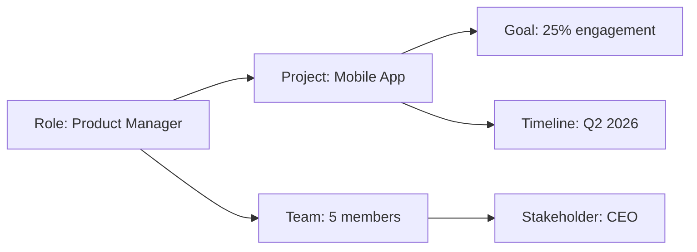

## What is personal memory?

Personal memory is LobeHub's system for making AI agents truly understand you. Instead of starting every conversation from scratch, agents build a **structured, evolving understanding** of your preferences, context, and work patterns.

This is what transforms generic AI assistants into personalized teammates that grow with you.

<Note>
  Personal memory is one of the three pillars of LobeHub's vision: **Create, Collaborate, Evolve**. It enables the co-evolution of humans and agents.
</Note>

## Why personal memory matters

### The problem with traditional AI

Most AI tools today are stateless:

- Every conversation starts from zero
- You repeat context constantly
- Agents forget your preferences
- No continuity between sessions
- Generic responses that don't adapt to you

### How memory changes everything

<CardGroup cols={2}>
  <Card title="Contextual awareness" icon="brain">
    Agents remember who you are, what you're working on, and how you prefer to work.
  </Card>
  <Card title="Adaptive behavior" icon="arrows-spin">
    Agents adjust their communication style, detail level, and approach based on your patterns.
  </Card>
  <Card title="Proactive assistance" icon="sparkles">
    Agents anticipate needs and offer relevant suggestions without being asked.
  </Card>
  <Card title="Continual improvement" icon="chart-line">
    The more you use LobeHub, the better your agents become at helping you.
  </Card>
</CardGroup>

## How memory works

### Continual learning

LobeHub uses a sophisticated continual learning system:

<Steps>
  <Step title="Conversation analysis">
    As you interact with agents, the **Memory Agent** analyzes conversations for insights:
    - Explicit preferences you state
    - Implicit patterns in your requests
    - Context about your work and projects
    - Communication style and technical level
  </Step>
  <Step title="Memory extraction">
    Key insights are extracted and structured:
    - Categorized by type (preference, fact, context)
    - Tagged with relevance and confidence
    - Linked to related memories
  </Step>
  <Step title="Storage and indexing">
    Memories are stored in a searchable, structured format:
    - Easily retrievable by context
    - Updated when new information conflicts
    - Organized for quick access
  </Step>
  <Step title="Contextual recall">
    When relevant, agents automatically retrieve and apply memories:
    - No need to repeat context
    - Responses tailored to your situation
    - Consistent experience across all agents
  </Step>
</Steps>

### White-box transparency

Unlike traditional "black box" AI memory, LobeHub's memory is **fully transparent and controllable**:

<Accordion title="View all memories">
  Access a complete list of what agents remember about you:
  - Browse by category
  - Search by keyword
  - Filter by date or relevance
  - See which conversations created each memory
</Accordion>

<Accordion title="Edit memories">
  Modify any memory:
  - Correct inaccuracies
  - Update outdated information
  - Clarify vague entries
  - Add additional context
</Accordion>

<Accordion title="Delete memories">
  Remove memories you don't want retained:
  - One-off deletions
  - Bulk delete by category
  - Clear all memories
  - Selective privacy control
</Accordion>

<Accordion title="Manual memory creation">
  Add memories directly without waiting for extraction:
  - Important context agents should know
  - Preferences you want to establish
  - Facts about your situation
  - Guidelines for agent behavior
</Accordion>

<Note>
  You have complete control over your memory. Agents can't remember anything you don't approve.
</Note>

## Types of memory

### Personal preferences

How you like to work and communicate:

<CodeGroup>
```yaml Communication Style
- Preference: Concise responses
- Detail level: Technical, skip basics
- Tone: Professional but conversational
- Format: Bullet points preferred over paragraphs
- Language: US English, avoid jargon
```

```yaml Work Preferences  
- Work hours: 9 AM - 6 PM EST
- Availability: Prefers async communication
- Meeting style: Agenda required, max 30 minutes
- Decision-making: Data-driven, wants multiple options
- Feedback: Direct and actionable
```
</CodeGroup>

### Personal context

Who you are and what you're doing:

<CodeGroup>
```yaml Professional Context
- Role: Senior Product Manager
- Company: B2B SaaS startup, 50 employees
- Industry: Marketing technology
- Team: 3 engineers, 1 designer, 1 analyst
- Reporting to: VP of Product
```

```yaml Current Projects
- Project: Mobile app redesign
- Status: Discovery phase
- Timeline: Q2 2026 launch
- Stakeholders: CEO, CTO, Head of Design
- Goals: Increase engagement 25%, reduce churn 10%
```
</CodeGroup>

### Skills and knowledge

What you know and what you're learning:

- **Expert in**: Product management, user research, SQL
- **Familiar with**: Python, React basics, data analysis
- **Learning**: Machine learning, advanced analytics
- **Interests**: AI/ML applications, productivity tools

### Patterns and habits

Recurring behaviors and workflows:

<Accordion title="Task patterns">
  - Weekly: Team sync on Mondays, sprint planning on Tuesdays
  - Monthly: Board reports, OKR reviews
  - Daily: Morning review of metrics, afternoon focus time
</Accordion>

<Accordion title="Common requests">
  - Frequently asks for: User research synthesis, SQL queries for analytics
  - Often needs: PRD templates, competitive analysis
  - Regular workflows: Feature prioritization, stakeholder updates
</Accordion>

<Accordion title="Decision criteria">
  - Prioritizes: User impact, business value, feasibility
  - Considers: Team capacity, technical debt, strategic alignment
  - Avoids: Scope creep, premature optimization
</Accordion>

### Historical context

Past projects and decisions:

- **Lessons learned**: What worked, what didn't, why
- **Past decisions**: Context and reasoning for future reference
- **Project history**: Previous initiatives and outcomes
- **Relationships**: Key collaborators and their roles

## Using memory effectively

### Providing initial context

When you first start using LobeHub, help agents learn about you:

<Steps>
  <Step title="Share professional context">
    Tell agents about:
    - Your role and responsibilities
    - Your team and organization
    - Current projects and priorities
  </Step>
  <Step title="State preferences explicitly">
    Be clear about:
    - How you like to communicate
    - What level of detail you need
    - Your preferred formats and styles
  </Step>
  <Step title="Add manual memories">
    Create memories for:
    - Important facts agents should always know
    - Recurring contexts to avoid repeating
    - Guidelines for agent behavior
  </Step>
</Steps>

### Natural conversation

Once initial context is provided, just work naturally:

<CodeGroup>
```plaintext Good Example
You: "Write a PRD for the mobile notifications feature"

Agent: *Recalls your PRD template preference, 
       your focus on user research data,
       and your stakeholder list*
       
       "I'll create a PRD following your standard template
       with sections for user research insights, success
       metrics, and stakeholder sign-offs..."
```

```plaintext How Memory Helps
Without memory:
- "What format would you like?"
- "What sections should I include?"
- "Who are the stakeholders?"

With memory:
- Uses your preferred template automatically
- Includes user research section (you always want this)
- Lists your stakeholders without asking
```
</CodeGroup>

### Refining over time

Memory improves as you work:

<Accordion title="Correct misunderstandings">
  When an agent gets something wrong:
  
  "Actually, I prefer bullet points over paragraphs for PRDs."
  
  The Memory Agent updates this preference.
</Accordion>

<Accordion title="Add new context">
  As your situation changes:
  
  "I'm now leading the mobile team in addition to web."
  
  Agents incorporate this context going forward.
</Accordion>

<Accordion title="Review memory periodically">
  Check your memory dashboard:
  - Remove outdated information
  - Update changed preferences
  - Add missing context
</Accordion>

## Memory Agent

The **Memory Agent** is a specialized built-in agent that manages your personal memory.

### Responsibilities

<CardGroup cols={2}>
  <Card title="Memory extraction" icon="microscope">
    Analyzes conversations to identify valuable insights worth remembering.
  </Card>
  <Card title="Memory organization" icon="folders">
    Categorizes and structures memories for easy retrieval.
  </Card>
  <Card title="Memory maintenance" icon="broom">
    Identifies outdated or conflicting memories and suggests updates.
  </Card>
  <Card title="Memory application" icon="magic-wand-sparkles">
    Determines when to inject relevant memories into agent context.
  </Card>
</CardGroup>

### Memory extraction process

<Steps>
  <Step title="Trigger analysis">
    After conversations, the Memory Agent reviews messages for extractable insights.
  </Step>
  <Step title="Identify candidates">
    Flags potential memories:
    - Explicit statements: "I prefer...", "I always..."
    - Repeated patterns: Consistent requests or behaviors
    - Important context: Role changes, project updates
  </Step>
  <Step title="Structure and categorize">
    Converts raw insights into structured memories:
    - Type: Preference, fact, context, pattern
    - Confidence: High, medium, low
    - Relevance: Which scenarios this applies to
  </Step>
  <Step title="Store and index">
    Saves to memory system with:
    - Timestamps
    - Source conversation
    - Related memories
    - Retrieval tags
  </Step>
</Steps>

### Interacting with Memory Agent

You can talk directly to the Memory Agent:

<CodeGroup>
```plaintext Add Memory
"Remember that I prefer morning meetings over afternoon ones."

✓ Memory added: Meeting time preference
```

```plaintext Query Memory  
"What do you remember about my current projects?"

Memory Agent lists all project-related memories.
```

```plaintext Update Memory
"Update my role: I'm now VP of Product, not Senior PM."

✓ Memory updated: Professional role
```

```plaintext Review Memory
"What preferences do you have about my communication style?"

Memory Agent shows all communication preferences.
```
</CodeGroup>

## Privacy and control

### Data ownership

<Accordion title="Your data, your control">
  All memories belong to you:
  - Stored in your workspace
  - Never shared with other users
  - Not used to train models
  - Fully exportable
</Accordion>

<Accordion title="Local or cloud storage">
  Choose where memory is stored:
  
  - **Cloud**: Sync across devices, accessible anywhere
  - **Local**: Complete privacy, offline access
  
  See [Database Configuration](/self-hosting/database) for details.
</Accordion>

<Accordion title="Memory export">
  Export all your memories:
  - JSON format for backup
  - CSV for analysis
  - Markdown for readability
</Accordion>

### Privacy features

<AccordionGroup>
  <Accordion title="Selective memory">
    Control what gets remembered:
    - Disable memory for specific conversations
    - Mark sensitive topics as "don't remember"
    - Set categories to never extract
  </Accordion>
  <Accordion title="Memory expiration">
    Set automatic expiration:
    - Time-based: Delete after 30/90/365 days
    - Project-based: Clear when project ends
    - Manual: You decide what to keep
  </Accordion>
  <Accordion title="Conversation history separation">
    Memory and conversation history are separate:
    - Delete conversations without losing memories
    - Keep memories without storing full conversations
    - Independent privacy controls
  </Accordion>
</AccordionGroup>

## Advanced memory features

### Memory categories

Organize memories by category:

- **Professional**: Work-related context and preferences
- **Personal**: Personal interests and habits  
- **Projects**: Project-specific information
- **Skills**: Knowledge and expertise areas
- **Relationships**: Colleagues, stakeholders, contacts
- **Custom**: Create your own categories

### Memory confidence levels

Each memory has a confidence score:

<Accordion title="High confidence (90-100%)">
  **Source**: Explicit statements, repeated patterns
  
  **Example**: "I always need data to back up product decisions"
  
  **Usage**: Agents apply these memories automatically
</Accordion>

<Accordion title="Medium confidence (60-89%)">
  **Source**: Inferred from behavior, occasional patterns
  
  **Example**: User often asks for competitive analysis
  
  **Usage**: Agents consider but may verify
</Accordion>

<Accordion title="Low confidence (0-59%)">
  **Source**: Single occurrence, ambiguous statements
  
  **Example**: User mentioned interest in a topic once
  
  **Usage**: Agents note but don't heavily rely on
</Accordion>

### Memory relationships

Memories can be linked:



Related memories provide richer context when recalled.

### Memory search

Find specific memories:

- **Keyword search**: Search memory content
- **Category filter**: Show only specific categories
- **Date range**: Memories from specific timeframe
- **Source conversation**: Find where memory originated
- **Confidence level**: Filter by how certain the memory is

## Memory across agents

### Shared memory pool

All your agents access the same memory:

<CardGroup cols={1}>
  <Card title="Consistent experience" icon="equals">
    Preferences apply across all agents—you don't repeat context when switching.
  </Card>
  <Card title="Collaborative learning" icon="users">
    Insights from working with one agent benefit all others.
  </Card>
  <Card title="Unified understanding" icon="sitemap">
    Your entire agent team has a coherent view of your needs.
  </Card>
</CardGroup>

### Agent-specific memory

Optionally, create agent-specific memories:

- **Use case**: Different communication styles for different agent roles
- **Example**: Technical agent uses jargon, executive agent avoids it
- **Control**: Mark memories as "all agents" or "specific agent"

## Best practices

### Building effective memory

<AccordionGroup>
  <Accordion title="Start with key context">
    When first using LobeHub, have a conversation with the Memory Agent:
    
    "Let me tell you about myself and how I work..."
    
    Cover:
    - Professional role and context
    - Current priorities
    - Communication preferences
    - Common workflows
  </Accordion>
  <Accordion title="Be explicit about preferences">
    State preferences clearly:
    
    ✅ "I always want PRDs to include a competitive analysis section"
    
    ❌ "Add competitive analysis" (too vague to memorize)
  </Accordion>
  <Accordion title="Correct mistakes immediately">
    When an agent misremembers:
    
    "Actually, that's not correct. I prefer X instead of Y."
    
    The Memory Agent updates immediately.
  </Accordion>
  <Accordion title="Review memory monthly">
    Schedule regular reviews:
    - Remove outdated context
    - Update changed preferences
    - Add new important context
  </Accordion>
</AccordionGroup>

### Privacy best practices

<AccordionGroup>
  <Accordion title="Don't store sensitive data">
    Avoid memorable facts like:
    - Passwords or credentials
    - Financial account details
    - Highly personal sensitive information
    
    Use for:
    - Work preferences
    - Professional context
    - General patterns and habits
  </Accordion>
  <Accordion title="Use local storage for sensitive contexts">
    For privacy-critical scenarios:
    - Self-host with local database
    - Disable cloud sync
    - Set short expiration times
  </Accordion>
  <Accordion title="Regular memory audits">
    Periodically review and clean:
    - What's being remembered
    - Whether it's still relevant
    - If it should remain stored
  </Accordion>
</AccordionGroup>

## Troubleshooting

<AccordionGroup>
  <Accordion title="Agent not recalling memories">
    **Possible causes**:
    - Memory not relevant to current context
    - Confidence level too low
    - Memory disabled for this conversation
    
    **Solutions**:
    - Make preference more explicit
    - Manually add high-confidence memory
    - Check memory settings
  </Accordion>
  <Accordion title="Incorrect memories">
    **Solutions**:
    - Edit the memory directly
    - Tell agent: "That's not correct, actually..."
    - Delete and recreate the memory
  </Accordion>
  <Accordion title="Too many irrelevant memories">
    **Solutions**:
    - Increase extraction threshold (less aggressive)
    - Delete low-value memories
    - Be more specific in conversations to avoid ambiguity
  </Accordion>
  <Accordion title="Memory not extracting">
    **Solutions**:
    - Be more explicit in stating preferences
    - Manually add important memories
    - Check if memory extraction is enabled
  </Accordion>
</AccordionGroup>

## Next steps

<CardGroup cols={2}>
  <Card title="Agents" icon="robot" href="/concepts/agents">
    Learn how agents use memory to adapt to you
  </Card>
  <Card title="Agent Groups" icon="users" href="/concepts/agent-groups">
    Discover how memory works in multi-agent collaboration
  </Card>
  <Card title="Privacy & Security" icon="shield" href="/self-hosting/database">
    Configure memory storage and privacy settings
  </Card>
  <Card title="Memory Management Tool" icon="brain" href="/agents/tools">
    Understand the memory management tool for agents
  </Card>
</CardGroup>